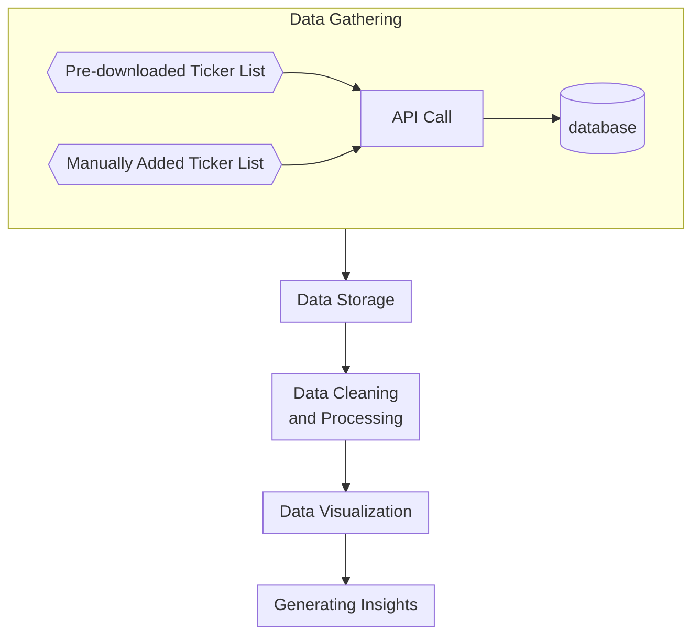

# Documentation of Finance Dashboard
The purpose of this document is to:
1. Elaborate on the primary goal of the project
2. Description of action plan
3. Lessons learned along the way

A diagram made using mermaid will be accompanying the document to serve as a visual guideline to the steps taken.
 
 

## Table of Contents

1. Goal of Dashboard
2. Data Sources and Tools
3. Log
 
 

## Goal of Dashboard
Besides from having personal stake in stock/ETF/crypto investing, I love the space of finance. My background in education was not Business/Finance-centric but I have self-learned many of the financial concepts needed to evaluate a company. Combining that with my passion for programming, I decided to build my own version of a financial dashboard that helps me in deciding whether or not to invest in a company. Subsequently, keeping track of the financial performance of companies I invest in. This project can be very extensive, however, I will keep it simple to start with and extend it as I go.

The current vision I have for the project is to have a consolidation of companies financials in a single place (similar to financial metrics that can be found on websites like yahoo finance, cnbc finance, etc.). The core part of it will be based on agglomeration of financial statements, and key metrics summarized. Later on, a DCF calculator will be added for a quick valuation of intrinsic value of a company. A summary page will be constructed to breakdown the financials of a company with insights into product segments, sales by geography, intrinsic value vs current price, and more. The generic idea is set but the specifics are not set in stone. This project will serve as a on-the-fly learning opportunity for me to program my ideas as well as identifying important valuation metrics of a company.

## Data Sources and Tools

The main core part of the financial data obtained will be from financial APIs at the beginning to get started but will be transitioned to a self-scraped data from [Data SEC](www.sec.gov) eventually. Several open-source tools/libraries may be used when needed to aid in processing and scraping these data. These tools include but not limited to:

1. Pandas
2. Airflow
3. Streamlit
4. pymongo
5. plotly

Streamlit will be used as the main open-source app framework for its ease of implementation. I will try to write the codebase in such a way where migration to other web-frameworks would be possible with minimal effort in the future since Streamlit has its limitation.

Plotly is chosen because it works very well with streamlit as opposed to matplotlib. Plotly also offers highly interactive figures that is much more customizable than matplotlib's.

 

## Action Plan

The plan will be segmented into different parts, namely:
1. Data gathering/extraction from API
2. Data storage to NoSQL database
3. Data cleaning and processing
4. Data presentation/visualization
5. Generate insights and presented on webpage

 
Before 2023-05-30

1. Enabled manual update of ticker list if interested ticker symbol is not in the pre-downloaded list.
2. Use st.secrets so usernames, passwords, API-keys are stored as secrets instead of in local/cloud txt files.
3. Selectable plotly charts. Can pick and choose whichever graph to show from a list of key-graphs. 
4. Instead of directly calling API (slow), first storing information in database (permitted as long as data not used commercially and not redistributed). This is also a workaround for the limited requests per day allowed for using free version of these APIs. 
5. Introduced DCF calculator - with customizable growth, discount rates, market conditions.
6. Published on streamlit community cloud server (free)
7. Cached data whenever possible to reduce load time
## Log
| Date       | Description                                                                      |
| ---------- | -------------------------------------------------------------------------------- |
| 2023-05-30 | Created the doc.md file. Previously completed work are briefly documented above. |

# Diagram

