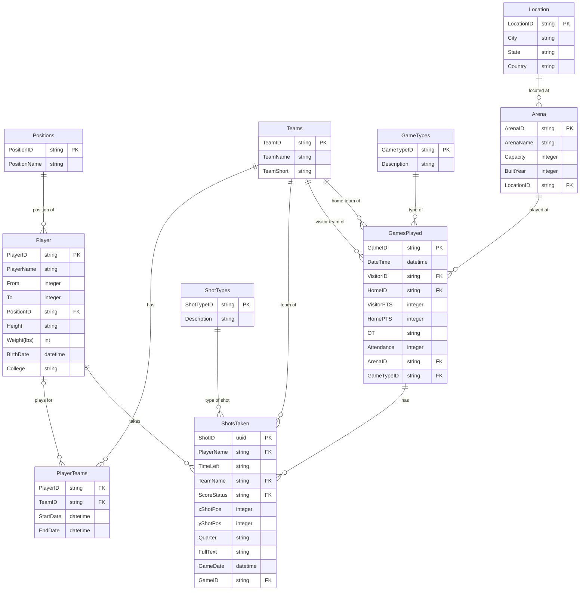

```mermaid
erDiagram
    GamesPlayed {
        GameID string PK
        DateTime datetime
        VisitorID string FK
        HomeID string FK
        VisitorPTS integer
        HomePTS integer
        OT string
        Attendance integer
        ArenaID string FK
        GameTypeID string FK
    }

    Player {
        PlayerID string PK
        PlayerName string
        From integer
        To integer
        PositionID string FK
        Height string
        Weight(lbs) int
        BirthDate datetime
        College string
    }

    Positions {
        PositionID string PK
        PositionName string
    }

    PlayerTeams {
        PlayerID string FK
        TeamID string FK
        StartDate datetime
        EndDate datetime
    }

    Teams {
        TeamID string PK
        TeamName string
        TeamShort string
    }

    ShotsTaken {
        ShotID uuid PK
        PlayerName string FK
        TimeLeft string
        TeamName string FK
        ScoreStatus string FK
        xShotPos integer
        yShotPos integer
        Quarter string
        FullText string
        GameDate datetime
        GameID string FK
    }

    ShotTypes {
        ShotTypeID string PK
        Description string
    }

    GameTypes {
        GameTypeID string PK
        Description string
    }

    Arena {
        ArenaID string PK
        ArenaName string
        Capacity integer
        BuiltYear integer
        LocationID string FK
    }

    Location {
        LocationID string PK
        City string
        State string
        Country string
    }

    Player |o--o{ PlayerTeams : "plays for"
    Teams ||--o{ PlayerTeams : "has"
    Player ||--o{ ShotsTaken : "takes"
    Teams ||--o{ ShotsTaken : "team of"
    GamesPlayed ||--o{ ShotsTaken : "has"
    Positions ||--o{ Player : "position of"
    GameTypes ||--o{ GamesPlayed : "type of"
    Teams ||--o{ GamesPlayed : "visitor team of"
    Teams ||--o{ GamesPlayed : "home team of"
    Arena ||--o{ GamesPlayed : "played at"
    Location ||--o{ Arena : "located at"
    ShotTypes ||--o{ ShotsTaken : "type of shot"

```