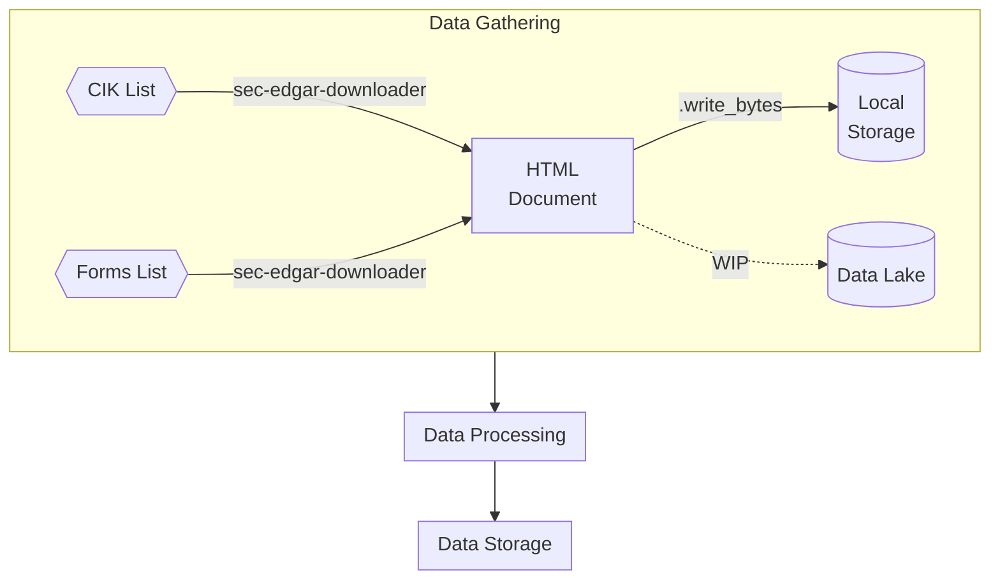

# Documentation of Scraping SEC.gov
The purpose of this document is two-fold:
1. Elaborate on the reasons of scraping for financial data
2. Description of action plan
3. Lessons learned along the way

A diagram made using mermaid will be accompanying the document to serve as a visual guideline to the steps taken.
 
 

## Table of Contents

1. Why self-scrape?
2. Data Sources and Tools
3. Log
 
 

## Why self-scrape?

There are loads of ready-made APIs out there that serve as secondary distributors of company financial information. I have personally used some of them from [Alpha Vantage](https://www.alphavantage.co/documentation/) and [Financial Modeling Prep](https://site.financialmodelingprep.com/). Using these APIs on its free-of-charge basis provides sufficient financial information for basic analysis on a company's financial health. Despite limitation on number of requests per day, I have never once hit the ceiling limit. However, much of the information that is needed to deep-dive into a company's financials are held behind paywalls. Therefore, I have decided to go to the source itself for these information, [U.S. Securities and Exchange Commission](www.sec.gov). Below I summarized the advantages and disadvantages of doing so:

| Advantages                                                                                                                           | Disadvantages                                                     |
| ------------------------------------------------------------------------------------------------------------------------------------ | ----------------------------------------------------------------- |
| Licensing only limited by SEC.gov  (summary can be found here [SEC Data Privacy and Security](https://www.sec.gov/privacy#intro)) | Unable to use for distribution as freely  (API dependent)      |
| Unlimited number of requests per day  (only limited by requests per second)                                                       | Limited to some number of requests per day by  API distributor |
| Data always kept up-to-date                                                                                                          | Data may not be latest information available                      |
| Most reliable source of public financial information                                                                                 | Dependent on how data is extracted and processed by API creator   |
| Difficult to interpret - requires lots of cleaning and processing from HTML/XML/XBRL formats                                         | Readily available in JSON/csv/table format for interpretation     |
| Only company filings available                                                                                                       | Market/Analyst/Macro-economic data are also available             |
| Free                                                                                                                                 | Free with paid-services available                                 |
 
 

## Data Sources and Tools

The main core part of the financial data obtained will be from [Data SEC](www.sec.gov). Several open-source tools/libraries may be used when needed to aid in scraping these data. These tools include but not limited to:

1. sec-edgar-api
2. sec-edgar-downloader
3. BeautifulSoup
4. Pandas
5. Airflow

 

## Action Plan

The plan will be segmented into different parts, namely:
1. Data gathering/extraction
2. Data cleaning and processing
3. Data storage

Airflow will be used to schedule these workflows and frequency of running the DAGs will be dependent on the companies considered since the workflows will be executed when new filings are made. 

 

## Log
| Date       | Description                                                                                                                                                                                                                                                                                                                       |
| ---------- | --------------------------------------------------------------------------------------------------------------------------------------------------------------------------------------------------------------------------------------------------------------------------------------------------------------------------------- |
| 2023-05-24 | Learned to request from sec.gov using requests library through [Accessing EDGAR Data](https://www.sec.gov/os/accessing-edgar-data).                                                                                                                                                                                               |
| 2023-05-25 | Found out about sec-edgar-api and sec-edgar-downloader for requesting and downloading company filings based on CIK.                                                                                                                                                                                                               |
| 2023-05-27 | Compared using pandas pd.read_html method vs BeautifulSoup (BS4) html/lxml parser to parse through 10-Q filing. Easier to use pandas since it reads all tables found within the HTML document, however for customizability, I devised my own method using BS4 by parsing through with triple nested for loops (not standardized). |

# Diagram

